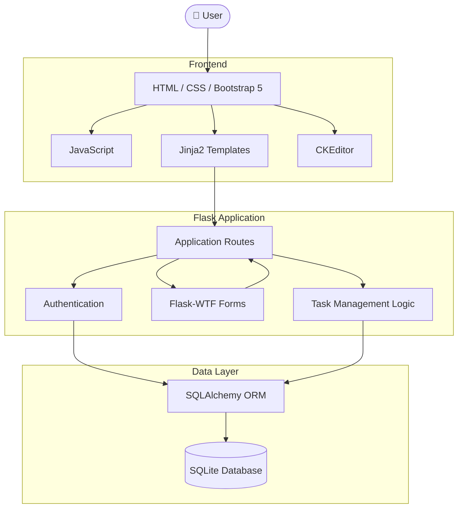

<p align="center">
  
</p>

<h1 align="center">Tasks2Do</h1>

<p align="center">
  <strong>A lightweight task management web application built with Flask.</strong>
</p>

<p align="center">
  
  
  
  
  
</p>

<p align="center">
  <em>Authentication · CRUD · Validation · Database Persistence · Task Organization</em>
</p>

<br>

<p align="center">
  
</p>

## Overview

**Tasks2Do** is a personal task management web application built from the ground up with **Python and Flask**.

It provides a complete workflow for creating, organizing, and tracking personal tasks. Users can create an account, manage their own tasks, assign categories and deadlines, filter and sort their task list, and mark tasks as completed.

The project was built as a practical exploration of how the main pieces of a small full-stack web application fit together — from authentication and form validation to database persistence and frontend interaction.

> **The goal:** keep the application small enough to understand, while still implementing the core pieces of a real web application.

---

## ✦ What Tasks2Do Does

<table>
<tr>
<td width="33%" align="center">

### 👤 Authentication

Register and log in with a personal account.

</td>
<td width="33%" align="center">

### ✓ Task Management

Create, edit, complete, and delete tasks.

</td>
<td width="33%" align="center">

### 🏷 Organization

Use categories, deadlines, filtering, and sorting.

</td>
</tr>
<tr>
<td width="33%" align="center">

### 🔐 Security

Password hashing, CSRF protection, and access control.

</td>
<td width="33%" align="center">

### 📝 Rich Text

Create formatted task descriptions with CKEditor.

</td>
<td width="33%" align="center">

### 📄 Pagination

Navigate through larger task lists page by page.

</td>
</tr>
</table>

---

## Architecture

Tasks2Do follows a simple server-rendered architecture built around Flask, SQLAlchemy, Jinja2 templates, and SQLite.




---

## ✦ Features

|     | Feature               | Description                                                  |
| :-: | --------------------- | ------------------------------------------------------------ |
|  👤 | **Authentication**    | Register and log in with a personal account                  |
|  🔐 | **Password Security** | Passwords are stored using secure hashing                    |
|  ➕  | **Create Tasks**      | Add titles, descriptions, categories, and optional deadlines |
|  ✏️ | **Edit Tasks**        | Update incomplete tasks                                      |
| 🗑️ | **Delete Tasks**      | Remove tasks from your list                                  |
|  ✅  | **Complete Tasks**    | Mark tasks as completed                                      |
|  ⏳  | **Deadlines**         | Set deadlines and track remaining time                       |
| 🏷️ | **Categories**        | Organize tasks using custom categories                       |
|  🔎 | **Filtering**         | Filter by category, creation date, deadline, or status       |
|  ↕️ | **Sorting**           | Sort tasks by date or deadline                               |
|  📄 | **Pagination**        | Navigate through tasks page by page                          |
|  📱 | **Responsive UI**     | Adapt the interface to different screen sizes                |
|  📝 | **Rich Text**         | Create formatted descriptions using CKEditor                 |

---

## 🛠 Tech Stack

### Backend

<p>
  
  
  
</p>

* **Python**
* **Flask**
* **Flask-SQLAlchemy**
* **Flask-Login**
* **Flask-WTF**
* **Flask-CKEditor**

### Frontend

<p>
  
  
  
  
</p>

* HTML5
* CSS3
* JavaScript
* Bootstrap 5
* Jinja2 Templates
* CKEditor

### Database

<p>
  
  
</p>

* **SQLite**
* **SQLAlchemy ORM**

---

##  Security & Validation

Security and validation are handled at several levels of the application.

| Mechanism            | Implementation                                     |
| -------------------- | -------------------------------------------------- |
| Password hashing     | **Werkzeug**                                       |
| Authentication       | **Flask-Login**                                    |
| CSRF protection      | **Flask-WTF**                                      |
| User-specific access | Tasks are associated with their corresponding user |
| Password validation  | Password structure validation                      |
| Input validation     | Username and password whitespace validation        |
| Task state           | Completed tasks cannot be edited                   |
| Deadline validation  | Deadlines cannot be set in the past                |

Each task is associated with the user who created it, keeping task operations restricted to the corresponding user.

---

##  Project Structure

```text
tasks2do/
│
├── instance/
│   └── task_manager.db
│
├── static/
│   ├── css/
│   │   ├── bootstrap.min.css
│   │   └── style.css
│   │
│   └── js/
│       └── bootstrap.bundle.min.js
│
├── templates/
│   ├── add_task.html
│   ├── base.html
│   ├── home_page.html
│   ├── login.html
│   ├── register.html
│   └── show_tasks.html
│
├── app.py
├── forms.py
├── requirements.txt
├── .gitignore
└── README.md
```

### Main Components

| File / Directory                         | Responsibility                                                           |
| ---------------------------------------- | ------------------------------------------------------------------------ |
| [`app.py`](./app.py)                     | Application routes, database models, authentication, and task operations |
| [`forms.py`](./forms.py)                 | Registration, login, and task forms with validation                      |
| [`templates/`](./templates/)             | Jinja2 HTML templates and application interface                          |
| [`static/css/`](./static/css/)           | Bootstrap and custom CSS                                                 |
| [`static/js/`](./static/js/)             | Frontend JavaScript functionality                                        |
| [`requirements.txt`](./requirements.txt) | Python dependencies                                                      |
| [`instance/`](./instance/)               | Local SQLite database                                                    |

---

## 🚀 Getting Started

### 1. Clone the repository

```bash
git clone https://github.com/EHMoeini/tasks2do.git
cd tasks2do
```

### 2. Create a virtual environment

#### Windows

```bash
python -m venv venv
venv\Scripts\activate
```

#### macOS / Linux

```bash
python3 -m venv venv
source venv/bin/activate
```

### 3. Install dependencies

```bash
pip install -r requirements.txt
```

### 4. Configure the Flask secret key

The application reads its secret key from the `FLASK_KEY` environment variable.

#### Windows PowerShell

```powershell
$env:FLASK_KEY="your-secret-key"
```

#### macOS / Linux

```bash
export FLASK_KEY="your-secret-key"
```

If `DB_URI` is not provided, the application uses SQLite:

```text
sqlite:///task_manager.db
```

### 5. Run the application

```bash
python app.py
```

Then open the local Flask address in your browser.

---

##  Core Engineering Pieces

Tasks2Do brings several common web-application concepts together in one small codebase:

```text
                    TASKS2DO
                       │
       ┌───────────────┼────────────────┐
       │               │                │
       ▼               ▼                ▼
 Authentication     Persistence      Validation
       │               │                │
 Flask-Login      SQLAlchemy ORM    Flask-WTF
       │               │                │
       └───────────────┼────────────────┘
                       │
                       ▼
                  Task Workflow
                       │
        ┌──────────────┼──────────────┐
        ▼              ▼              ▼
       CRUD       Organization     Tracking
                     │              │
                Categories      Deadlines
                Filtering       Completion
                Sorting
```

### What this project demonstrates

* Building a Flask application from the ground up
* Designing a simple relational data model
* Working with an ORM through SQLAlchemy
* Implementing user authentication
* Handling forms and server-side validation
* Protecting requests against CSRF
* Implementing CRUD operations
* Restricting resources to their corresponding users
* Building server-rendered pages with Jinja2
* Adding frontend interaction with JavaScript
* Organizing and presenting data through filtering, sorting, and pagination

---

##  Project Scope

Tasks2Do focuses on the fundamentals of a **personal task management system** rather than attempting to become a large-scale productivity platform.

The current implementation intentionally keeps the architecture relatively simple:

```text
User
 │
 ├── Register / Login
 │
 ▼
Task Manager
 │
 ├── Create & Edit
 ├── Categories
 ├── Deadlines
 ├── Filter & Sort
 └── Pagination
 │
 ▼
Complete / Delete
```

This makes the project small enough to understand while still covering the main building blocks of a full-stack web application.

---

## About

Tasks2Do was developed as a practical Flask project to explore the development of a complete task-management workflow.

The project combines:

**Authentication · Database Persistence · Form Validation · CRUD Operations · Filtering · Sorting · Pagination · Frontend Interaction**

while keeping the overall application lightweight and understandable.

---

<p align="center">
  
</p>

<p align="center">
  <sub>Built with Python & Flask</sub>
</p>
